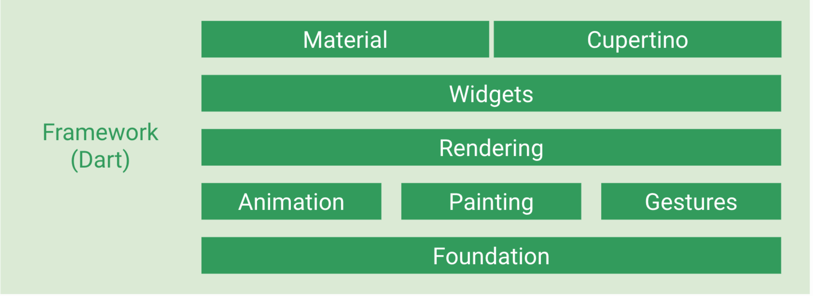

<!--
 * @Date: 2020-09-29 15:19:53
 * @LastEditors: hu.wenjun
 * @LastEditTime: 2020-09-29 16:53:44
-->
[参考资料](https://tech.meituan.com/2018/08/09/waimai-flutter-practice.html)

[学习资料]https://juejin.im/post/6844903843260530701，https://github.com/CarGuo/gsy_github_app_flutter

基本上完全复制美团技术团队的汇总～～～，死记硬背加一丢丢理解中，但是由于之前看过flutter的一本书籍，发现目前看继承类竟然难度不大，后续待学习吧，哭 

### 理解 Flutter 和 RN/Weex 的差异

Flutter 和 RN/Weex的差异，核心在于渲染的基础由自己实现，简单来说，
1. flutter的代码经过Flutter引擎直接就渲染到了屏幕上
2. 而RN/Weex的代码需要先跑到Native层处理一下，然后经过Native层渲染到屏幕

所以说flutter的效率会高，但是RN/Weex可以直接使用Native提供的丰富组件和属性，但是flutter只能使用Flutter引擎暴露出来的底层API来做封装


### Flutter Framework

flutter的框架部分完全使用Dart语言实现，并且有着清晰的分层架构。
框架底层是flutter引擎，引擎主要负责图形绘制（skia）文字排版（libtxt）和提供Dart运行时，引擎全部使用C++实现



那么由此引出下面问题

### 为什么选择Dart作为flutter的开发语言

Dart是一种强类型，跨平台的客户端开发语言。由Google负责开发和维护

Dart提供了3种运行方式：
1. dart2js编译成JS，运行在常规浏览器中
2. 使用DartVM直接在命令行中运行Dart代码
3. AOT方式编译成机器码，例如Flutter APP
   
那么最终dart作为flutter开发语言的原因是： 跨平台（ios和安卓），无锁垃圾回收机制，JIT&AOT运行模式，支持开发时快速迭代和生产发布后最大程度发挥硬件性能

### 渲染库（Rendering）
Flutter的控件树在实际显示时会转换成对应的渲染对象（RenderObject）树来实现布局和绘制操作。Widget -> RenderObject
```
abstract class RendererBinding extends BindingBase with ServiceBinding, SchedulerBinding, HitTestable {...}
abstract class RenderObject extends AbstractNode with DiagnosticableTreeMixin implements HitTestTarget {...}

//后续都是继承RenderObject
abstract class RenderBox extends RenderObject{...}
class RenderParagraph extends RenderBox{...}
class RenderImage extends RenderBox{...}
class RenderFlex extends RenderBox with ContainerRenderObjectMixin<RenderBox, FlexParentData>, RenderBoxContainerDefaultsMixin<RenderBox, FlexParentData>, DebugOverflowIndicatorMixin{...}
```
RendererBinding是渲染树和Flutter引擎的胶水层，负责管理帧重绘，窗口尺寸和渲染相关参数变化的监听。
RenderObject是渲染树中所有节点的基类，定义了布局，绘制和合成相关的接口
在Flutter界面渲染过程中分为三个阶段：布局，绘制，合成， 布局和绘制在flutter框架中完成，合成是flutter引擎完成

### 控件库（Widgets）
Flutter中一切皆“控件”
它包含的最主要的几个有：
```
class WidgetFlutterBinding extends BindingBase with GestureBinding, ServiceBinding, SchedulerBinding, PaintingBinding,RendererBinding,WidgetsBinding {...}
abstract class Widget extends DiagnosticableTree {...}
abstract class StatelessWidget extends Widget {...}
abstract class StatefulWidget extends Widget {...}
abstract class RenderObjectWidget extends Widget {...}
abstract class Element extends DiagnosticableTree implements BuildContext {...}
class StatelessElement extends ComponentElement {...}
class StatefulElement extends ComponentElement {...}
abstract class RenderObjectElement extends Element {...}
```

WidgetFlutterBinding是flutter的控件框架和flutter引擎的胶水层。Widget是所有控件的基类。RenderObjectWidget所有的实现类则负责提供配置信息并创建具体的RenderObjectElement。 Element是Flutter用来分离控件树和真正的渲染对象的中间层，控件用来描述对应的Element属性，控件重建之后可能会复用同一个element。

RenderObject是基础，StatelessWidget 和 StatefulWidget 只会创建RenderObjectElement， 然后 只会创建RenderObjectElement才是真正的RenderObject对象

