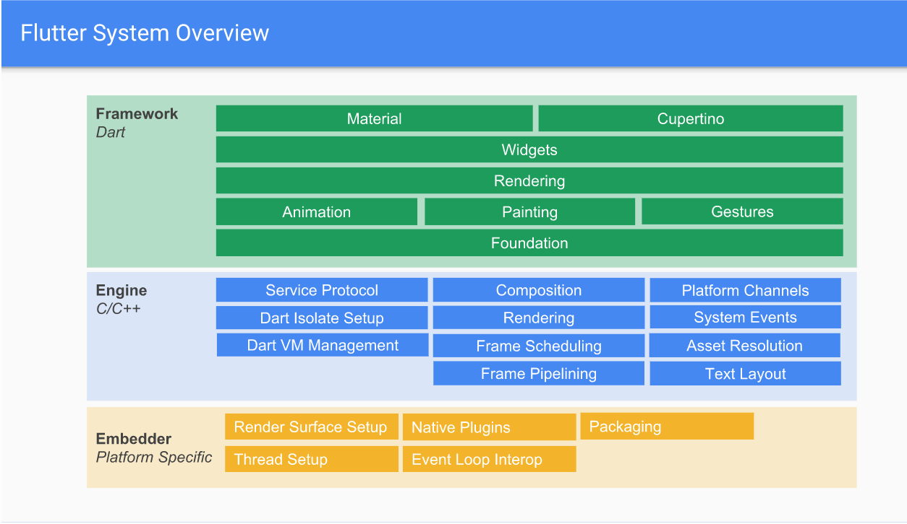

<!--
 * @Date: 2020-10-12 21:47:06
 * @LastEditors: hu.wenjun
 * @LastEditTime: 2020-10-13 19:22:12
-->
### flutter 引擎 

说一下自己对此图的理解

首先 flutter 主要核心  dart framework ， flutter引擎 以及 运行平台

flutter 引擎 核心是 skia(2D渲染技术) 以及 dart(主要是垃圾回收机制以及面向对象虚拟机)

Embedder 其实就是运行平台（iOS，安卓，其他自定义flutter引擎实现），主要功能是替flutter引擎创建和管理线程

Flutter 引擎需要嵌入环境给4个 task runner 提供引用
其中 4个task runner 主要是

Platform Task runner(通常是安卓主线程或者apple平台Foundation引用的线程)

UI Task runner（dart线程）ps:大量技术放在上图中的 dart vm 线程池中， 因为此处操作量大会引起卡顿 

GPU Task runner （主要是GPU加速渲染，根据 UI Task runner生成的图形树进行渲染，此处也是会使flutter卡顿）

I/O Task runner （执行 GPU 线程一些非常昂贵的操作，譬如图片解码器）

其实根据flutter引擎的这些task runner 是非常容易理解的，如果了解浏览器的知识，就会发现其实chromium浏览器的进程分开是很相似的 

进程分为：

Browser进程： 主进程

Renderer进程： 渲染进程

GPU： 硬件加速渲染图像

插件进程： 保证插件奔溃不影响浏览器稳定性