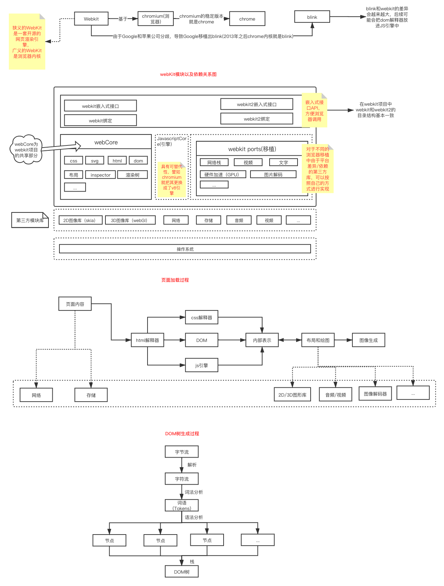

<!--
 * @Date: 2020-10-12 12:00:21
 * @LastEditors: hu.wenjun
 * @LastEditTime: 2020-10-14 10:23:34
-->
### webkit内核学习

一些基础知识，
话不多说，先上画好的图
其中一些信息已经注释了

#### 浏览器的多进程

chrome采用多进程的架构，其中进程主要分为：

1、Browser 进程 （主进程）

2、Renderer 进程 （渲染进程，html,dom等）

3、插件 进程 （防止插件奔溃影响浏览器稳定）

4、GPU 进程 （图像渲染时实施硬件加速）PS：移动端中，此进程并不存在，所以把绘图和合成工作放在Browser进程中一个线程来完成

#### V8引擎

