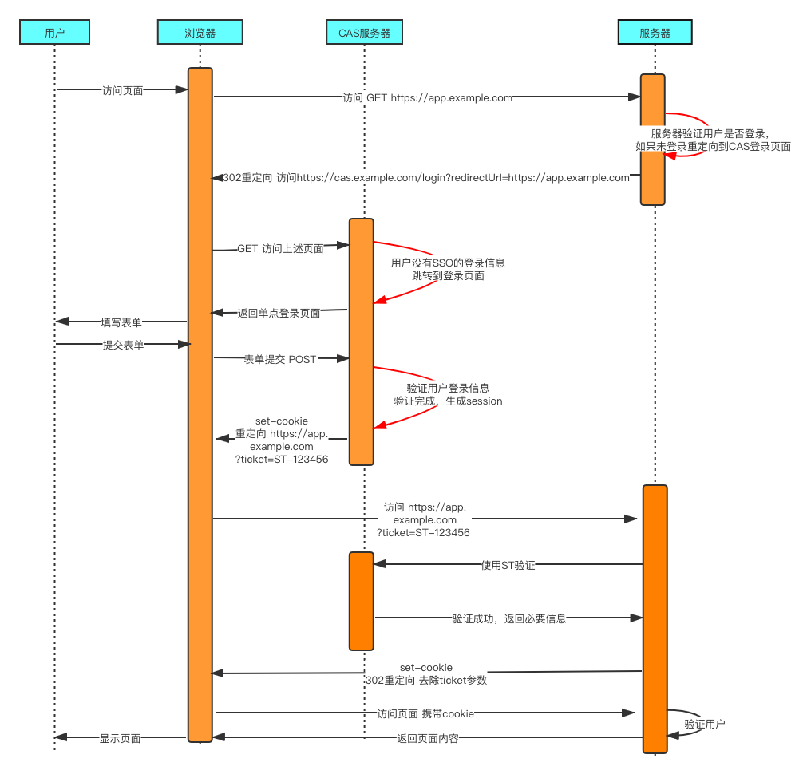
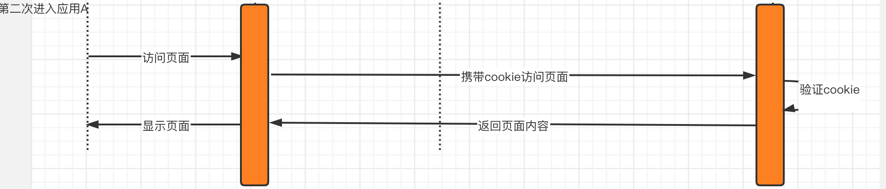
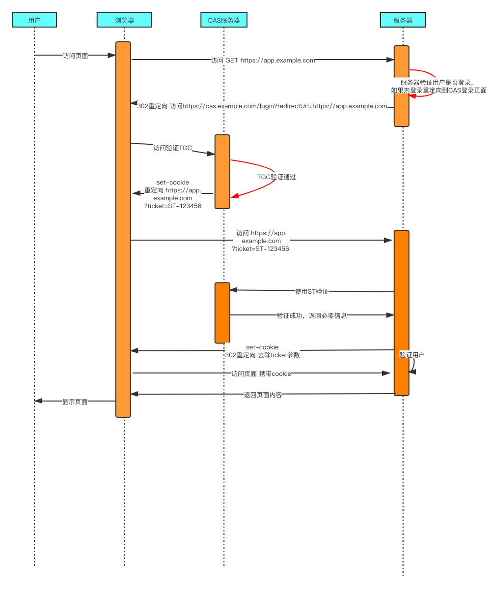

<!--
 * @Date: 2020-09-28 19:49:21
 * @LastEditors: hu.wenjun
 * @LastEditTime: 2020-09-28 20:51:22
-->
资料来源:
[单点登录（SSO）看这一篇就够了](https://developer.aliyun.com/article/636281)
[图文并茂，为你揭开“单点登录“的神秘面纱](https://juejin.im/post/6844904038555729927#heading-8)

CAS官网上的标准流程，具体流程如下：
1. 单点登录用户第一次访问应用A
用户访问app系统，app系统是需要登录的，但用户现在没有登录。
跳转到CAS server，即SSO登录系统，以后图中的CAS Server我们统一叫做SSO系统。 SSO系统也没有登录，弹出用户登录页。
用户填写用户名、密码，SSO系统进行认证后，将登录状态写入SSO的session，浏览器（Browser）中写入SSO域下的Cookie。
SSO系统登录完成后会生成一个ST（Service Ticket），然后跳转到app系统，同时将ST作为参数传递给app系统。
app系统拿到ST后，从后台向SSO发送请求，验证ST是否有效。
验证通过后，app系统将登录状态写入session并设置app域下的Cookie。
至此，跨域单点登录就完成了。以后我们再访问app系统时，app就是登录的。接下来，我们再看看访问app2系统时的流程。
具体时序图如下：

2. 单点登录用户第二次访问应用A

3. 单点登录用户第一次访问应用B

用户访问app2系统，app2系统没有登录，跳转到SSO。
由于SSO已经登录了，不需要重新登录认证。
SSO生成ST，浏览器跳转到app2系统，并将ST作为参数传递给app2。
app2拿到ST，后台访问SSO，验证ST是否有效。
验证成功后，app2将登录状态写入session，并在app2域下写入Cookie。
这样，app2系统不需要走登录流程，就已经是登录了。SSO，app和app2在不同的域，它们之间的session不共享也是没问题的。
