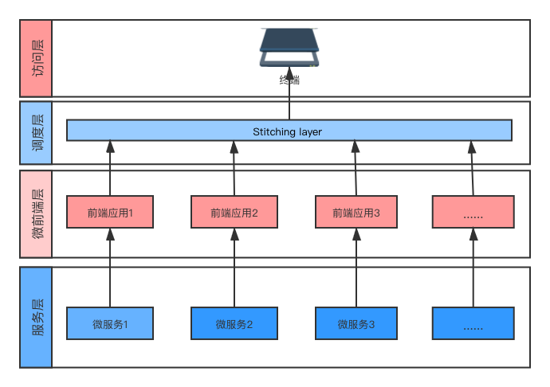
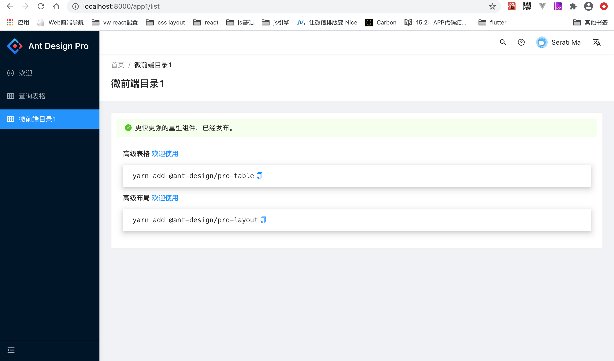

<!--
 * @Date: 2020-09-29 16:55:40
 * @LastEditors: hu.wenjun
 * @LastEditTime: 2020-10-26 21:01:02
-->
资料：
1. https://juejin.im/post/6844903953734336525
2. https://juejin.im/post/6844903880153628680
3. https://juejin.im/post/6844903816295350279
4. https://juejin.im/post/6847902222525661197
5. https://zhuanlan.zhihu.com/p/78362028
6. https://mp.weixin.qq.com/s/p98EkrxhNtAKb9ex0eY61w
7. https://github.com/phodal/microfrontends
8. https://mp.weixin.qq.com/s/o7L_Sxl1s0uKywRy-Ao5fg
   
### 什么是微前端

个人理解：独立开发，独立运行，独立部署的前端应用整合成一个应用

### 各种不同的微前端实施方案

nginx: (不同路由或者子域名对应不同项目，运维处理)
iframe: iframe嵌套，天然满足JS隔离和CSS隔离，但是iframe兼容性需要处理
js entry: 所有子应用资源打包到一个bundle文件中，并行加载优势并没有体现
html entry: 可以实现JS隔离（umd）和CSS隔离，但是，多实例应该是不能很好的隔离


### 微前端实践

微前端架构的优势，其实就是MPA和SPA架构优势的合集，即保证应用具备独立开发权的同时，又有将它们整合到一起保证产品完整的流程体验的能力

SPA优势：
优点：应用直接无刷新切换，增强用户体验
缺点： 强耦合

MPA
优点：部署简单，各应用之间硬隔离，天生具备技术栈无关，独立开发，独立部署的特性。
缺点：页面跳转时重刷页面，体验差

那么SPA和MPA结合下，应用的架构应该是什么样呢？



#### 路由问题解决

[single-spa](https://github.com/single-spa/single-spa)

#### app entry

加载方式： 构建时加载 和 运行时加载
构建时子应用的发布必然导致主应用的发布，耦合度比较高
所以使用运行时

接下来就是该怎么样加载
分为  JS entry 或者是 html entry 

JS entry 就是把所有的资源打包到一个bundle中，打出来的包体积会庞大，那么资源的并行加载的特性没有被合理的使用
```
<html>
  <head>
    <title>test!</title>
  </head>
  <body>
    <h1>Welcome to Feed me!</h1>

    <!-- 这些脚本不会马上渲染应用 -->
    <!-- 而是分别暴露全局变量 -->
    <script src="https://a.example.com/bundle.js"></script>
    <script src="https://b.example.com/bundle.js"></script>

    <div id="micro-frontend-root"></div>

    <script type="text/javascript">
      // 这些全局函数是上面脚本暴露的
      const microFrontendsByRoute = {
        '/': window.renderA,
        '/b': window.renderB,
      };
      const renderFunction = microFrontendsByRoute[window.location.pathname];

      // 渲染第一个微应用
      renderFunction('micro-frontend-root');//其实主要使用路由绑定的形式
    </script>
  </body>
</html>

```

html entry 是 通过 Web Component 集成
其实和JS entry 有异曲同工之处，提供容器，然后进行实例化
```
<html>
  <head>
    <title>test</title>
  </head>
  <body>
    <h1>Welcome to Feed me!</h1>

     <!-- 这些脚本不会马上渲染应用 -->
    <!-- 而是分别提供自定义标签 -->
    <script src="https://a.example.com/bundle.js"></script>
    <script src="https://b.example.com/bundle.js"></script>

    <div id="micro-frontend-root"></div>

    <script type="text/javascript">
      // 这些标签名是上面代码定义的
      const webComponentsByRoute = {
        '/': 'micro-frontend-a',
        '/b': 'micro-frontend-b',
      };
      const webComponentType = webComponentsByRoute[window.location.pathname];

      // 渲染第一个微应用（自定义标签）
      const root = document.getElementById('micro-frontend-root');
      const webComponent = document.createElement(webComponentType);
      root.appendChild(webComponent);
    </script>
  </body>
</html>

```
样式表隔离

多个子应用之间会存在样式的冲突，为了避免冲突，我们采用的方式可以是动态加载样式表，同时卸载子应用时，也一起卸载样式表，是浏览器重新生成cssDOM.

那么此时html entry就可以达到卸载子应用的同时可以卸载样式表，只需要把目标元素的innerHtml置为空， 但是子应用和主应用的样式隔离，多实例的样式隔离还是不能很好的处理。

#### 模块导入

主应用需要对子应用做一些生命周期的控制，而子应用的部署方式未知，所以需要使用umd模式的导入方式来做处理（global export）

#### JS隔离
如何保证各个子应用之间的全局变量不受影响，可以说是各个子应用之前加一个约定好的前缀，但是各个部门之间的口头约定往往导致线上bug，所以说qiankun团队增加了一个JS沙箱环境，是具体就是子应用加载时，分别给全局状态打下快照，卸载子应用时，就会回滚到原来的全局状态


#### qiankun
什么是qiankun 它是一个基于single-spa的微前端实现库，由蚂蚁金服提供的比较成熟的微前端的框架。

   
#### @umijs/plugin-qiankun 实践

本文目的在于记录对plugin-qiankun的实践应用，其中需要完成的需求如下：

##### npm包版本如下： 
"umi": "^3.2.14"
"qiankun": "^2.1.1"
"@umijs/plugin-qiankun": "^2.16.0"

##### 基座建立

[Ant Design Pro](https://pro.ant.design/docs/getting-started-cn)
空白文件夹譬如micro-umi,运行如下命令：
```
yarn create umi
```
or
```
npm create umi
```
安装依赖
```
npm install
```
本地运行
```
npm start
```
在基座中加入qiankun以及适用于qiankun的umi的npm包
```
npm install --save-dev qiankun @umijs/plugin-qiankun
```
基座应用设置

```
//config/config.ts
qiankun: {
  master: {
    apps: [
        {
          name: 'app1', // 唯一 id
          entry: '//localhost:8001', // html entry
        }
    ],
    //   jsSandbox: true, // 是否启用 js 沙箱，默认为 false
    //   prefetch: true, // 是否启用 prefetch 特性，默认为 true
  },
}
```
此时基座设置完成

##### 子应用建立

和基座一样生成一个项目，同时安装@umijs/plugin-qiankun，谨记，@umijs/plugin-qiankun的版本要一致

开始配置子应用
设置
```
//config/config.ts
qiankun: {
    slave: {}
  },
```
然后设置
```
//src/app.ts
export const qiankun = {
  // 应用加载之前
  async bootstrap(props: any) {
    console.log('app1 bootstrap', props);
  },
  // 应用 render 之前触发
  async mount(props: any) {
    console.log('app1 mount', props);
  },
  // 应用卸载之后触发
  async unmount(props: any) {
    console.log('app1 unmount', props);
  },
}
```
此段代码对应的是子应用的生命周期

配置结束，运行，结果如下：


##### 主应用和子应用通信

需要配合useModel()使用，确保已安装了 @umijs/plugin-model 或 @umijs/preset-react

上面采用的是“路由绑定”形式装载子应用，所以使用的方式为
```
// src/app.ts
export function useQiankunStateForSlave() {
  const [masterState, setMasterState] = useState({});
 
  return {
    masterState,
    setMasterState,
  }
}
```
配置结束之后就可以在子应用中使用
具体使用如下：
```
//src/pages/Welcome.tsx
import { useModel } from 'umi';

const {masterState, setMasterState} = useModel('@@qiankunStateFromMaster');
  console.log(masterState, "=====masterPropsmasterPropsmasterPropsmasterProps===")
  useEffect(() => {
    setMasterState({
      name: '张三',
      age: 2
    })
    return () => {}
  }, [])
  //Objectage: 2name: "张三"__proto__: Object "=====masterPropsmasterPropsmasterPropsmasterProps==="
```
##### 基于项目的思考

中后台系统的应用权限管理

每个中后台系统，基本都是需要获取用户权限来限制某些页面的访问权。那么在微前端这种使用场景，最好是由主应用来统一管理每个子应用的用户权限等信息。最好还能不改变原来单独访问子应用时的逻辑。

假设token放在localStorage中，这里想到了2个方案：

【统一处理】一旦进入任一子应用，主应用取出token发出一个checkLogin请求，后端检查2个子应用的登录态，只要任一没登录就触发login逻辑，如果都登录了就返回2个子应用的userInfo，主应用再分别传递userInfo给子应用。（需要后端加接口支持）

【分开处理】一旦进入任一子应用，主应用取出2个token发出2个checkLogin请求，经转发至子应用的域名后，子应用的2个后端各自检查登录态，有则返回userInfo。主应用只要没有拿到2份userInfo，就触发login逻辑，再分别传递userInfo给子应用。

子应用通过当前域名识别出是否位于主应用，是则不走自己的登录校验逻辑。


