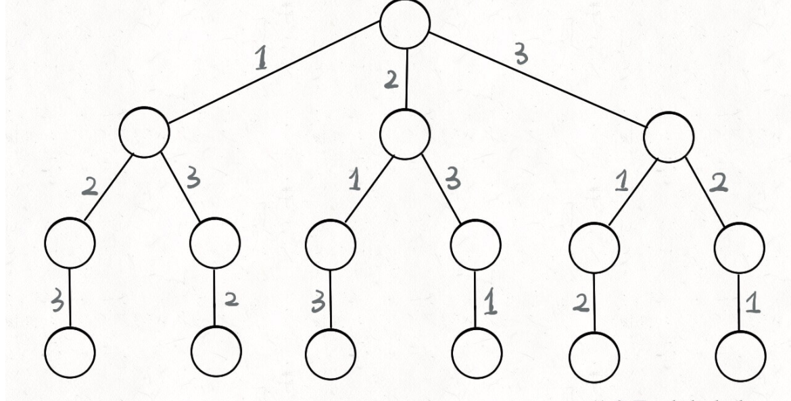
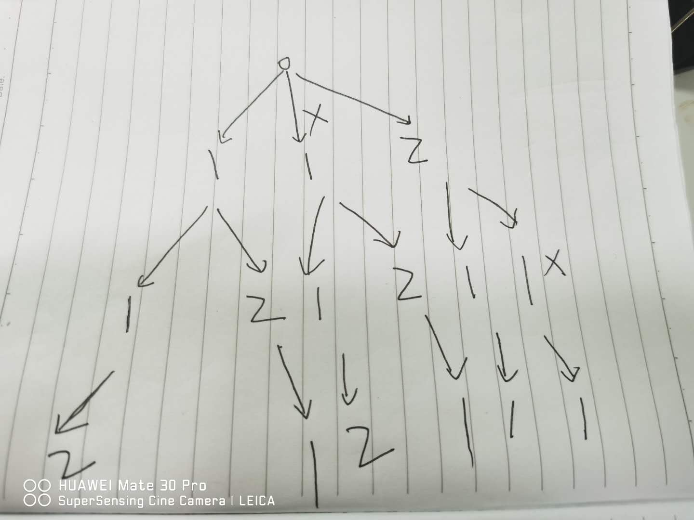

<!--
 * @Date: 2020-09-27 20:07:26
 * @LastEditors: hu.wenjun
 * @LastEditTime: 2020-09-27 21:29:46
-->
### 回溯算法

#### 各大厂面试题汇总
1. [组合总和](https://leetcode-cn.com/problems/combination-sum/discuss/16502/A-general-approach-to-backtracking-questions-in-Java-(Subsets-Permutations-Combination-Sum-Palindrome-Partitioning)/?utm_source=LCUS&utm_medium=ip_redirect_q_uns&utm_campaign=transfer2china)
2. [组合总和 II](https://leetcode-cn.com/problems/combination-sum-ii/)
3. [全排列](https://leetcode-cn.com/problems/permutations/)
4. [全排列 II](https://leetcode-cn.com/problems/permutations-ii/)
5. [括号生成](https://leetcode-cn.com/problems/generate-parentheses/)
6. [括号生成](https://leetcode-cn.com/problems/generate-parentheses/)


#### 框架套路
解决一个回溯问题，实际上就是一个决策树的遍历过程，那么只需要考虑3个问题

1. 路径
2. 剪枝
3. 结束条件
   
代码套路
```
let ans = []
//剪枝的必要条件是排序,升序排序
nums.sort((a, b) => a - b)
const backtrace = (list) => {
  if(){
    //结束条件
    return 
  }
  for(){//遍历
    //回溯核心
    list.push()
    backtrace()
    list.pop()
  }
}

backtrace()
return ans
```

力扣举例说明：
***
题目1:[全排列](https://leetcode-cn.com/problems/permutations/)

给定一个 <strong>没有重复</strong> 数字的序列，返回其所有可能的全排列
示例：
输入： [1,2,3]
输出：
[
  [1,2,3],
  [1,3,2],
  [2,1,3],
  [2,3,1],
  [3,1,2],
  [3,2,1]
]

首先画决策树如下：


涉及到没有重复字眼，所以一般使用used处理

解答结果如下：
```
var permute = function(nums) {
    const ans = [];
    nums = nums.sort((a,b) => a - b)
    const backtrace = (list,used) => {
        if(list.length === nums.length){
            ans.push([...list])
            return
        }
        for(let i = 0; i< nums.length; i++){
            if(used[i]) continue
            list.push(nums[i])
            used[i] = true
            backtrace([...list], [...used])
            list.pop()
            used[i] = false
        }
    }

    backtrace([],[])
    return ans;
};

<!-- 执行用时：
88 ms
, 在所有 JavaScript 提交中击败了
92.91%
的用户
内存消耗：
41.7 MB
, 在所有 JavaScript 提交中击败了
5.00%
的用户 -->
```
***
题目2:[全排列II](https://leetcode-cn.com/problems/permutations/)

给定一个<strong>可包含重复</strong>数字的序列，返回所有不重复的全排列。
示例：
输入： [1,1,2]
输出：
[
  [1,1,2],
  [1,2,1],
  [2,1,1]
]

首先，我们可以先复制第一道的解法，查看打印结果如下：
[[1,1,2],[1,2,1],[1,1,2],[1,2,1],[2,1,1],[2,1,1]]
然后我们发现和实际的结果是差异的，主要是返回结果有重复的值，这时候我们就要重新安排剪枝
具体决策树如下，需要剪枝的内容已经在树上画出

从决策树上我们可以看出，第一层，如果循环中的第二个值和第1个值相同,并且第一个值没有被使用过，（第一层循环的时候used[1] = false）那么可以跳出循环，代码如下
```
var permuteUnique = function(nums) {
    const ans = [];
    nums = nums.sort((a,b) => a - b)
    const backtrace = (list,used) => {
        if(list.length === nums.length){
            ans.push([...list])
            return
        }
        for(let i = 0; i< nums.length; i++){
          //此处和第一题的不同之处
            if((i > 0 && nums[i] === nums[i-1] && !used[i-1])) continue
            if(used[i]) continue
            list.push(nums[i])
            used[i] = true
            backtrace([...list], [...used])
            list.pop()
            used[i] = false
        }
    }

    backtrace([],[])
    return ans;
};
```

***
题目3:[组合总和 II](https://leetcode-cn.com/problems/combination-sum-ii/)

给定一个数组 candidates 和一个目标数 target ，找出 candidates 中所有可以使数字和为 target 的组合。

candidates 中的每个数字在每个组合中只能使用一次。

示例：
输入：  candidates = [10,1,2,7,6,1,5], target = 8
输出：
[
  [1, 7],
  [1, 2, 5],
  [2, 6],
  [1, 1, 6]
]

首先我们读题：
需要用到决策树，每个数字在每个组合中只能用到一次,所以使用used, 有target值，结束条件是sum===target
由于输入数组中有重复的值，那么我们应该还可以按照重复的值进行剪枝，看全排列第二题，需要进行剪枝
```
var combinationSum2 = function(candidates, target) {
    const ans = [];
    candidates = candidates.sort((a,b) => a - b)
    const backtrace = (list,used, sum) => {
        if(sum === 0){
            ans.push([...list])
            return
        }
        for(let i = 0; i < candidates.length; i++){
            let temp = sum - candidates[i]
            if((i > 0 && candidates[i] === candidates[i-1] && !used[i-1])) continue
            if(temp < 0) continue
            if(used[i]) continue
            list.push(candidates[i])
            used[i] = true
            backtrace([...list], [...used], temp)
            list.pop()
            used[i] = false
        }
    }

    backtrace([],[],target)
    return ans;
};
//[[1,1,6],[1,2,5],[1,5,2],[1,6,1],[1,7],[2,1,5],[2,5,1],[2,6],[5,1,2],[5,2,1],[6,1,1],[6,2],[7,1]]
```
发现已经能减掉一部分数据，那么我们接着进行剪枝
那就是终极秘密，使用start，代码如下：
```
/**
 * @param {number[]} candidates
 * @param {number} target
 * @return {number[][]}
 */
var combinationSum2 = function(candidates, target) {
    const ans = [];
    candidates = candidates.sort((a,b) => a - b)
    const backtrace = (start,list,used, sum) => {
        if(sum === 0){
            ans.push([...list])
            return
        }
        for(let i = start; i< candidates.length; i++){
            let temp = sum - candidates[i]
            if((i > 0 && candidates[i] === candidates[i-1] && !used[i-1])) continue
            if(temp < 0) continue
            if(used[i]) continue
            list.push(candidates[i])
            used[i] = true
            backtrace(i, [...list], [...used], temp)
            list.pop()
            used[i] = false
        }
    }

    backtrace(0,[],[],target)
    return ans;
};//[[1,1,6],[1,2,5],[1,7],[2,6]]
```
剪枝完成